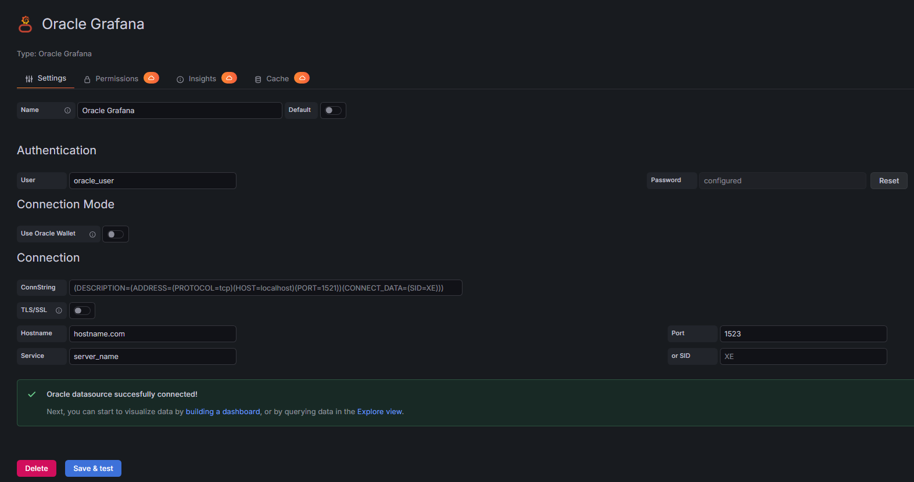
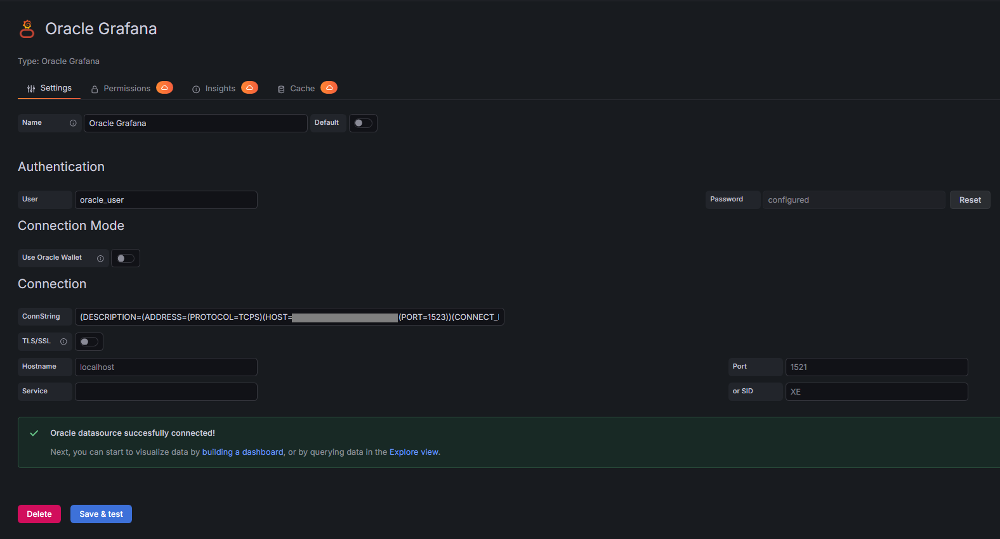
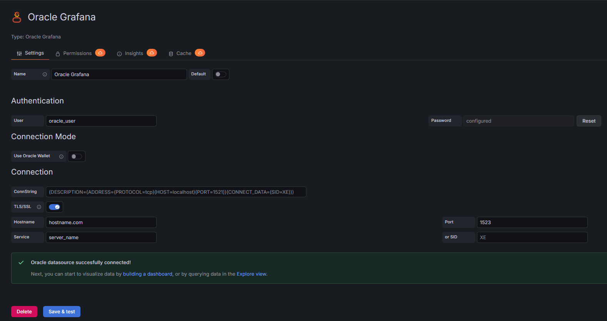
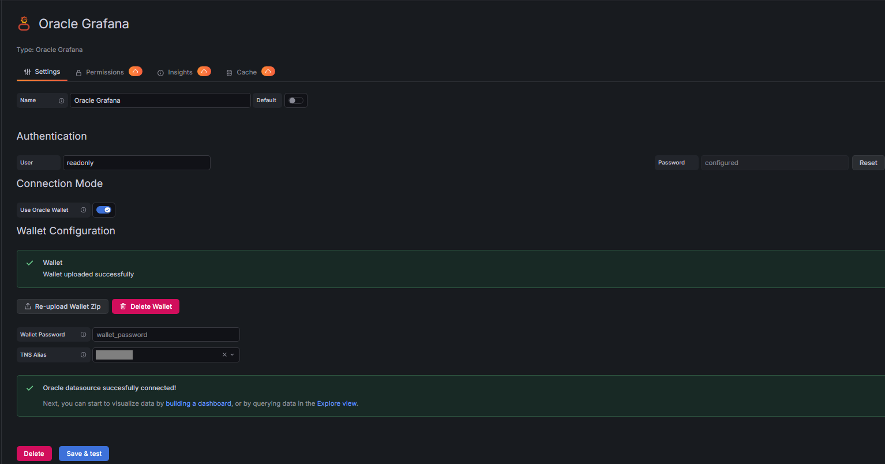

# Oracle Grafana data source plugin

Plugin for translating Oracle queries (SELECT) to grafana dashboards.

It has support for Quey variables and simple variables on SQL preview.

Variable with multiple values will be supported in the future.

## Requirements
* Grafana 9.5+
* Oracle 12+
* Go 1.26+
* Mage

## Running Locally

### Installation

Install backend dependencies:

```bash
go mod tidy
```

Install frontend dependencies:

```bash
npm install
```

Run the docker compose file to start the grafana and oracle containers:

```bash
docker-compose up -d
```

### Running the plugin

To run locally at localhost:3000, run the following command:

```bash
npm run server
```

## Building

To create a bundle for deployment, run the following command:

```bash
npm run bundle
```


## Plugin Installation
Grafana servers can load plugins usualy from the /var/lib/grafana/plugins folder, so extract the albertowd-oraclegrafana-datasource-bundle-1.0.0.tar.gz to this folder.

From there, the plugin can be found, but will not be automatically installed without the `GF_PLUGINS_ALLOW_LOADING_UNSIGNED_PLUGINS=albertowd-oraclegrafana-datasource` environment variable or `allow_loading_unsigned_plugins=albertowd-oraclegrafana-datasource` in tue grafana.ini file defining the plugin id.

Restart the grafana server and then the new data source must be visible at the Data source creation list:


## Configuration

The Oracle Grafana datasource plugin supports multiple connection modes to accommodate different Oracle database deployments:

### Connection Modes

#### 1. Standard Connection (Simple Fields)

Configure the connection using individual fields:

- **Hostname**: Oracle database server hostname or IP address (e.g., `localhost`)
- **Port**: Oracle listener port (default: `1521`)
- **Service**: Oracle service name (e.g., `XEPDB1`)
- **SID**: Oracle System Identifier (e.g., `XE`) - use either Service or SID, not both
- **User**: Database username
- **Password**: Database password (stored securely)



#### 2. Connection String (ConnString)

For advanced configurations, you can provide a complete Oracle connection descriptor in the `ConnString` field. When using this option, the simple fields (hostname, port, service, SID) are ignored.

Example connection string:
```
(DESCRIPTION=(ADDRESS=(PROTOCOL=tcp)(HOST=localhost)(PORT=1521))(CONNECT_DATA=(SID=XE)))
```

**Note**: If your connection string contains `PROTOCOL=TCPS`, TLS will be automatically enabled.



#### 3. TLS/SSL Connections

Enable the **TLS/SSL** toggle to establish encrypted connections to Oracle databases configured with secure transport (TCPS protocol). This is required when connecting to Oracle listeners that enforce SSL/TLS encryption.

- TLS can be enabled manually via the toggle switch
- TLS is automatically enabled when using a ConnString with `PROTOCOL=TCPS`
- The plugin uses SSL with verification disabled by default for flexibility with self-signed certificates



#### 4. Oracle Cloud Wallet Connections (ATP/ADW)

For Oracle Autonomous Database (ATP/ADW) and other cloud deployments that require Oracle Wallets:

1. **Enable Wallet Mode**: Toggle the "Use Oracle Wallet" switch
2. **Upload Wallet**: Click "Upload Wallet Zip" and select your Oracle Cloud wallet zip file (maximum 10 MB)
   - The wallet must contain `tnsnames.ora`, `sqlnet.ora`, and certificate files (`cwallet.sso` or `ewallet.p12`)
   - Upon successful upload, TNS aliases will be automatically detected and displayed
3. **Select TNS Alias**: Choose the appropriate TNS alias from the dropdown (populated from `tnsnames.ora`)
4. **Wallet Password**: (Optional) Enter the wallet password if your wallet is password-protected
5. **Username/Password**: (Optional) Provide database credentials
   - If left empty, the plugin will use wallet-embedded credentials
   - If provided, these credentials override the wallet's embedded authentication

**Wallet Connection Features**:
- Automatic TNS alias detection from uploaded wallets
- Secure wallet storage in Grafana's data directory
- Support for both wallet-embedded authentication and explicit credentials
- Automatic SSL/TLS configuration for cloud connections
- Wallet persistence across Grafana restarts
- Wallet deletion option to remove uploaded credentials



## Queries
The plugin only support the SELECT query.

But it has a preview feature on the query configuration page so the user can view how it will run after replace all the Grafana variables within.

It can use any simple variable created on the Grafana instance, just prefix the variable name with `$` on the query editor.

It includes the default ones too: `$__from` and `$__to` from the dashboard:


## Timeseries
The plugin can only see string variables, for now, so, the fields must be converted before using in `timeseries` charts:


## Query Variables
Also, it can be configured variables using the data source as well, with custom SQL that returns only one column:


